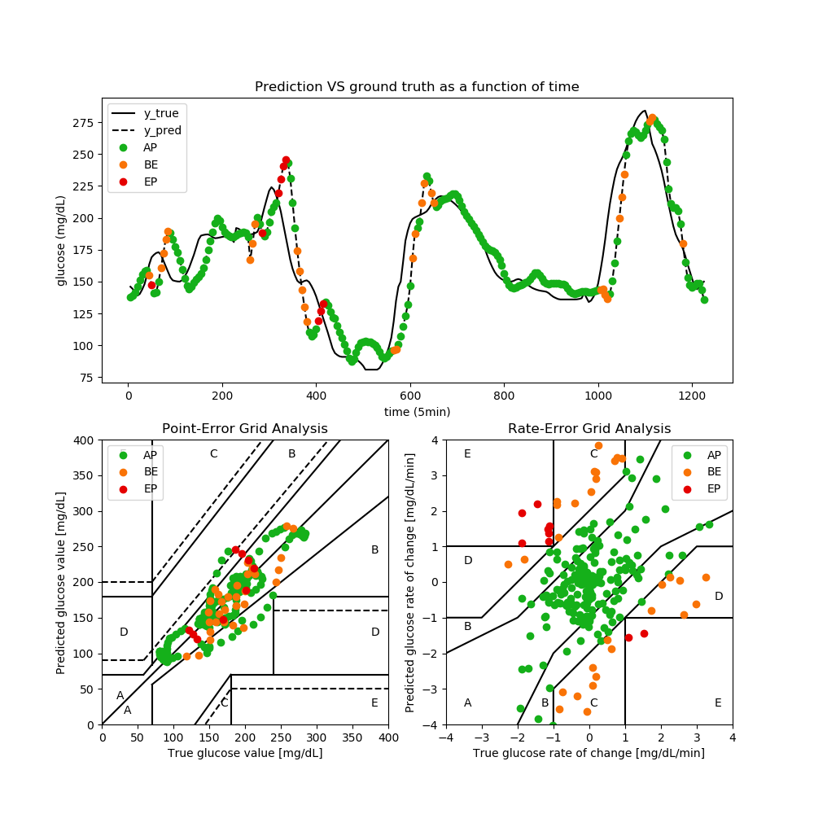

# CG-EGA Python Implementation

[](https://zenodo.org/badge/latestdoi/194119067)

This is the implementation of the Continuous Glucose-Error Grid Analysis (CG-EGA) adapted to glucose prediction in Python. It follows the description of Kovatchev *et al.* [1]. It gives a measure of the clinical acceptability of the glucose predictions made by a model.

## Getting Started

### Prerequisites

To run the CG-EGA, you will need the following ```Python 3.6``` libraries
```
matplotlib 3.1.0
numpy 1.16.3
pandas 0.24.2
```

### How to use

```python
>>> from cg_ega import CG_EGA
>>> y_true, y_pred = np.load("example.npy")
>>> freq = 5
>>> cg_ega = CG_EGA(y_true, y_pred, freq)
>>> print("AP, BE, EP:", cg_ega.reduced())
AP, BE, EP: (0.8367346938775511, 0.12653061224489795, 0.036734693877551024)
>>> cg_ega.plot(day=0)
```



## References

[1] Kovatchev, B. P., Gonder-Frederick, L. A., Cox, D. J., & Clarke, W. L. (2004). Evaluating the accuracy of continuous glucose-monitoring sensors: continuous glucose–error grid analysis illustrated by TheraSense Freestyle Navigator data. *Diabetes Care*, 27(8), 1922-192
